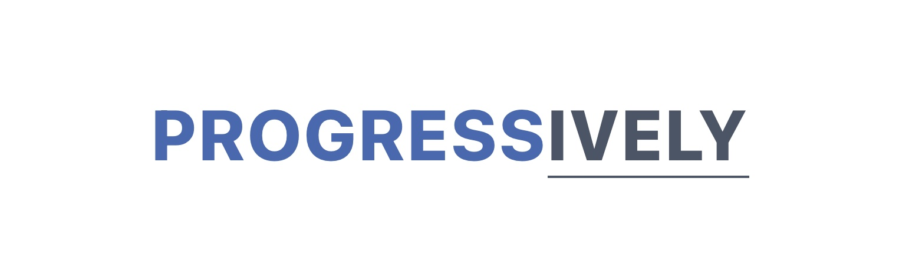

 
 

React SDK:  
JavaScript SDK: 

A feature flag solution focusing on accessibility, simplicity and providing **lightweight client side SDKs**.

[The documentation website](https://mfrachet.github.io/progressively/) provides all the necessary information in order to get started.

<i>Built on top of <a href="https://nestjs.com/">NestJs</a> and <a href="https://remix.run/">Remix.run</i>.

