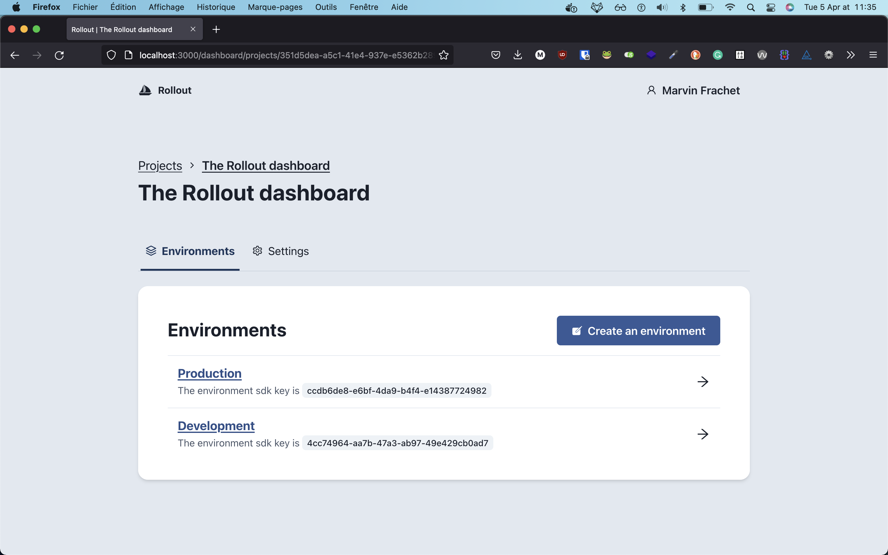
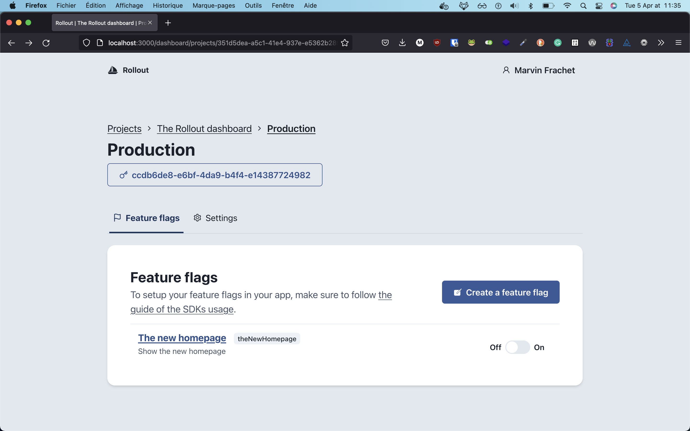

# Project overview

This project provides a way to activate and deactivate features live. In order to improve the experience, it comes with distinct entities:

- Projects
- Environments
- Feature flags
- Strategies

## Projects

When using the service with your account, you can create or be part of different projects. These project generally represent different products or platform specific (mobile / web) applications.

You can have as many projects as you want bound to a user account.

## Environments

Each project owns a list of environment. For instance, you can activate a specific feature for a given environment, like staging, development or production. Naming the environment and managing them is up to you.

## Feature flags

Each environment owns a list of feature flags. A feature flag is what will be evaluated and sent to the client application so that it can decide to show a functionality (or not).

## Strategies

Strategies are the computational part of the tool: they corresponds to restriction in order to provide the good flag variation. For instance, you may want to show the activated variant of the flag for only a bunch of people using their email address.

